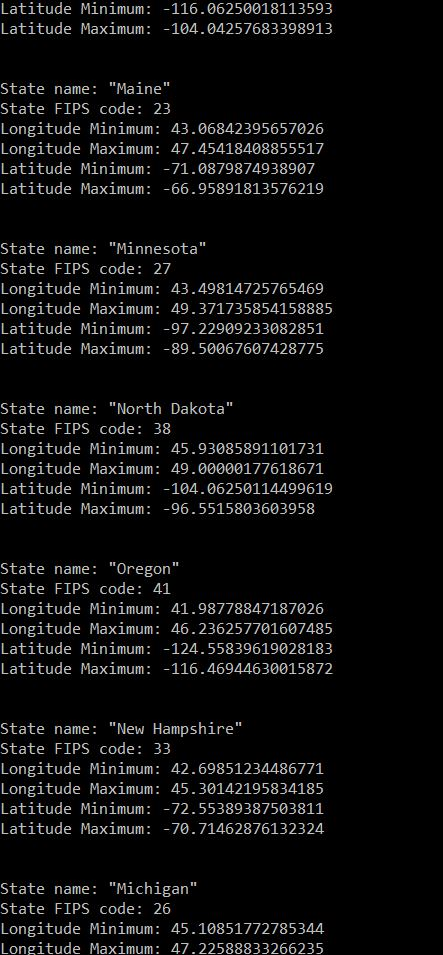

# Extracting data from a GeoJSON file (part one)
This project contains a python script that extracts portions of data from a GeoJSON file.  For part one, only string manipulations will be used to extract the necessary data.  Later in part two, the same extractions will be done using python's json library to view the GeoJSON data as dictionaries rather than strings.

### Objectives
Using only iterations, string sequences, and string manipulations:
1. Extract state names
2. Extract state FIPS codes
3. Report on the following statistics:
    * Longitude Minimum
    * Longitude Maximum
    * Latitude Minimum
    * Latitude Maximum

### Formatted Output
Displaying only a portion of the output:

